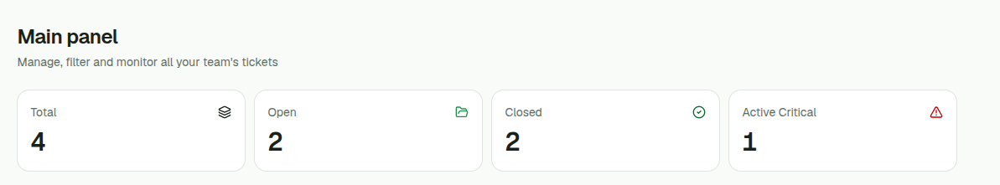
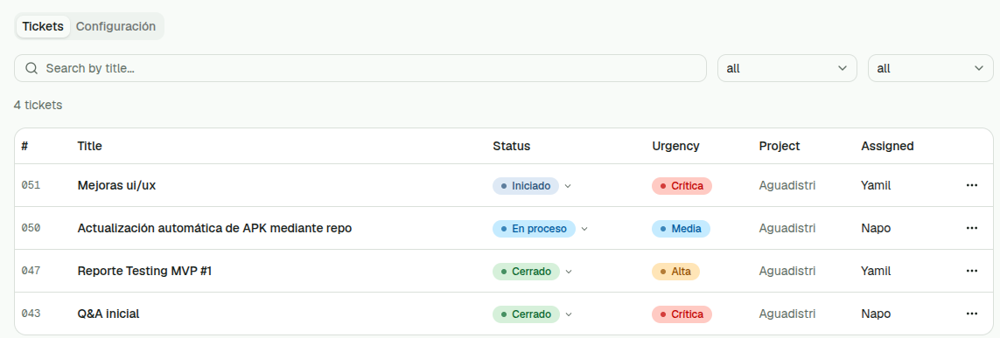
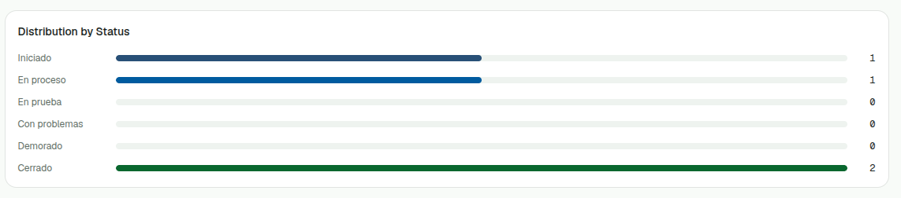
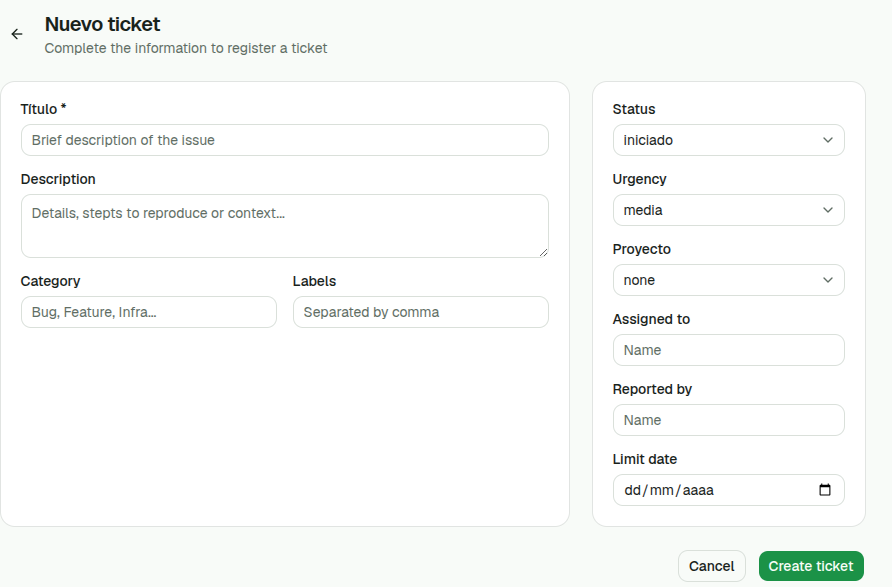
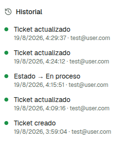

## Ticket Management
(NextJS + Supabase)-based system to track your projects activities, issues and features development.

## Install
- clone repo
- run ```npm install```

## Run
- create .env and configure these keys:
```
ADMIN_EMAIL=
ADMIN_PASSWORD=
AUTH_JWT_SECRET=
SUPABASE_URL=
NEXT_PUBLIC_SUPABASE_URL=
NEXT_PUBLIC_SUPABASE_PUBLISHABLE_KEY=
POSTGRES_DATABASE=
POSTGRES_HOST=
POSTGRES_PASSWORD=
POSTGRES_PRISMA_URL=
POSTGRES_URL="
POSTGRES_URL_NON_POOLING=
POSTGRES_USER=
SUPABASE_ANON_KEY=
SUPABASE_JWT_SECRET=
SUPABASE_SECRET_KEY=
SUPABASE_SERVICE_ROLE_KEY=
```
- run ```npm run dev```

## API

- (POST) /api/auth/login
- (GET) /api/tickets
- (POST) /api/tickets
- (GET) /api/tickets/:id
- (PATCH) /api/tickets/:id
- (DELETE) /api/tickets/:id
- (GET) /api/metrics

## Screenshots

### Basic metrics


### Tickets section


### Distribution by status


### New ticket


### Ticket history
